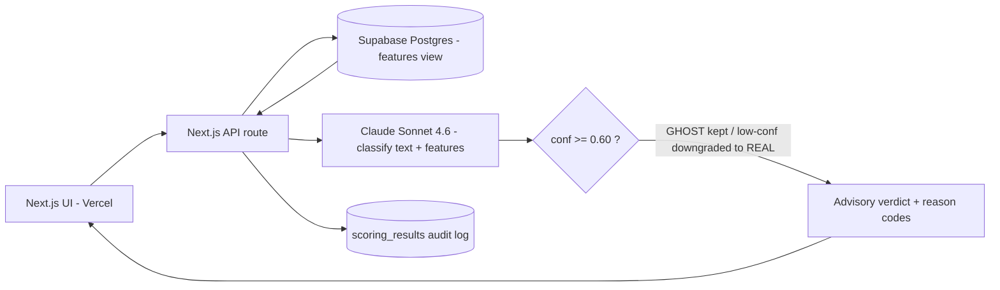

# ARCHITECTURE — AutoApply Ghost-Job Detector

An architecture decision record for the ghost-job classifier. The one-line summary: **deterministic SQL features + a single LLM call + a precision-first confidence gate** — deliberately *not* a multi-agent system, and deliberately keeping the counting work out of the model.

## 1. Problem & context
Job seekers waste applications on postings that won't hire (perma-reposted, pipeline/resume-harvesting, vague, already filled). The detector flags these as an **advisory** signal inside AutoApply. Volume is high and per-posting cost matters; the cost of a wrong answer is asymmetric (see §7).

## 2. Decision drivers
- **Recall on ghosts matters most** — a missed ghost = a wasted application.
- **Per-posting cost must stay low** — this runs on every posting a user scores.
- **A real job must never be silently killed** — hence advisory output + a precision gate (see `GUARDRAILS.md`).
- **Latency tolerance is moderate** (interactive, but not sub-second-critical).

## 3. Runtime topology

```
                    ┌──────────────────────────┐
   Next.js UI ─────▶│   Next.js API route       │
   (Vercel)         │   (Vercel serverless)     │
        ▲           └────────────┬─────────────┘
        │                        │ 1. fetch JD + features
        │                        ▼
        │           ┌──────────────────────────┐
        │           │  Supabase Postgres        │
        │           │  job_postings (raw)       │
        │           │  job_posting_features VIEW │  ◀── SQL computes:
        │           └────────────┬─────────────┘      repost_count_90d,
        │                        │ features + JD        posting_age_days,
        │                        ▼                      cross_board_duplicates
        │           ┌──────────────────────────┐
        │           │  Claude Sonnet 4.6        │  2. classify (text + features)
        │           │  GHOST_CLASSIFIER_SYSTEM  │     -> verdict + confidence + reasons
        │           └────────────┬─────────────┘
        │                        │ 3. precision-first gate: decide()
        │                        ▼
        │           ┌──────────────────────────┐
        │           │  conf >= 0.60 ?           │  GHOST kept; else downgraded to REAL
        │           └────────────┬─────────────┘
        │                        │ 4. advisory verdict + reason codes
        └────────────────────────┘
                                 │ 5. write
                                 ▼
                       scoring_results (audit log in Supabase)
```

Mermaid version (renders on GitHub):



## 4. Orchestration pattern
**Single LLM call, not multi-agent.** The task is one classification with structured output; a planner/worker crew would add latency and cost for no accuracy gain. The only "pipeline" is: SQL features → one model call → deterministic gate. Choosing the simplest topology that meets the bar is the decision.

## 5. When NOT to use an agent (the deliberate split)
The strongest signals — **how many times a role was reposted in 90 days, how old the posting is, how many boards carry it** — are deterministic facts. Counting them is a `GROUP BY`, not a judgment call, so they live in a **Supabase view (`job_posting_features`)**, never in an LLM call. The model only does what it's good at: weighing *language* (vagueness, pipeline phrasing, specificity) against those facts. This keeps cost down, makes the signals auditable, and is the clearest example in the portfolio of refusing to use an agent where a query suffices.

## 6. Model & cost economics
Measured on the 75-example benchmark (40 stratified + 35 adversarial), at the locked 0.60 threshold:

| Model | F1 | Recall | $/posting | p50 latency | Decision |
|---|---|---|---|---|---|
| Haiku 4.5 | 0.86 | **0.91** | $0.0012 | 1.62s | Rejected — misses ghosts (91% recall) |
| **Sonnet 4.6** | 0.93 | **1.00** | $0.0035 | 2.93s | **Chosen** — full recall at best cost-per-quality |
| Opus 4.8 | 0.95 | 1.00 | $0.0075 | 2.28s | Rejected — ~2x cost for marginal F1 gain |

**Selection reasoning:** Haiku is 3x cheaper but drops to 91% recall — it lets ghosts through, which is the one error this product can't afford. Opus is marginally more accurate at double the cost. **Sonnet** gives 100% recall at a third of Opus's price, so it wins on cost-per-quality.

**Cost levers documented:** SQL features cost $0 (no tokens); Batch API (50% off) is available for bulk list scoring; a Haiku pre-filter on obvious cases with Sonnet escalation is a viable future optimization if volume demands it.

## 7. Failure modes & mitigations
- **Over-flagging vague/sparse real jobs as GHOST** (the characteristic error — all false positives are this direction). Mitigated by the advisory framing + the precision gate (`GUARDRAILS.md`).
- **Missing a sophisticated ghost** (e.g. PERM postings, already-filled reqs). Mitigated by the adversarial eval set that specifically includes these, and by recall-first tuning.
- **Stale feature data** (repost counts lag). Degrade gracefully; the model still has the JD text.

## 8. Consequences & trade-offs
Gained: low cost, auditable signals, full recall, a defensible operating point. Gave up: fine-grained precision control (the model's confidence is weakly calibrated — see `GUARDRAILS.md`). **Scale path:** the feature view uses correlated subqueries for clarity; at volume, move to a materialized view refreshed on ingest, and consider the Haiku-prefilter/Sonnet-escalation routing to cut cost further.
